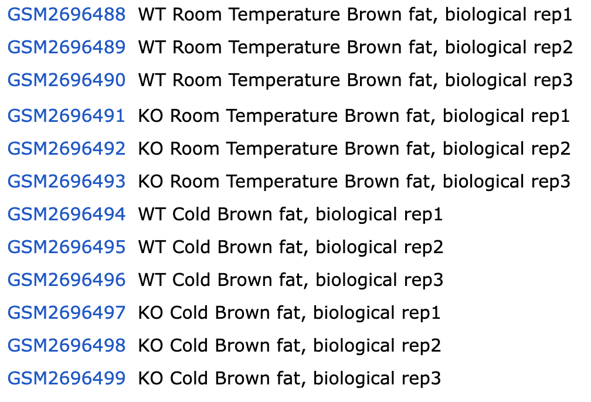

```{r class.source = 'fold-hide', setup, include=FALSE}
library(knitr)
library(rmdformats)
library(readr)
library(dplyr)
library(limma)
options(max.print="75")
opts_chunk$set(echo=TRUE, 
	             cache=TRUE,
               prompt=FALSE,
               tidy=TRUE,
               comment=NA,
               message=FALSE,
               warning=FALSE)
opts_knit$set(width=75)
```

```{r}
setwd("/Users/annia/Desktop/UOC/DADES ÒMIQUES/ACT2.2/ACT2.2")
getwd()
WorkingDir<-getwd()
DataDir <- file.path(WorkingDir, "dades") 
ResultsDir <- file.path(WorkingDir, "resultats") 
```

## TAULA DE CONTINGUTS

-   [CAS 1: Efecto del tratamiento con SHAM1 en la expresión de células
    T-ALL](#Efecto-del-tratamiento-son-SHAM1-en-la-expresión-de-células-T-ALL)
-   [CAS 2: Comparación entre tres tipos de cáncer de mama]

# CAS 1: Efecto del tratamiento con SHAM1 en la expresión de células T-ALL

El conjunto de datos para el ejercicio está disponible en la entrada de
la Serie GSE18198 en Gene Expression Omnibus. Consiste en el análisis de
perfiles de expresión de líneas celulares humanas T-ALL tratadas con
DMSO o SAHM1. En resumen, las proteínas NOTCH regulan vías de
señalización involucradas en la diferenciación celular, proliferación y
muerte. La sobreactivación de la señalización Notch se ha observado en
numerosos cánceres y se ha estudiado extensamente en el contexto de la
leucemia linfoblástica aguda de células T (T-ALL), donde más del 50% de
los pacientes tienen NOTCH1 mutante. Moduladores de pequeñas moléculas
de estas proteínas serían importantes para entender el papel de las
proteínas NOTCH en procesos biológicos malignos y normales. En este
estudio, los investigadores estaban interesados en medir los cambios
globales en la expresión génica tras el tratamiento de las líneas
celulares T-ALL humanas HPB-ALL y KOPT-K1 con solo vehículo (DMSO) o
SAHM1, un péptido alfa-helicoidal derivado de la proteína coactivadora
MAML1. Por lo tanto, diseñaron un experimento que consiste en cultivos
triplicados de células KOPTK1 o HPB-ALL tratadas con DMSO solo o SAHM1
(20 uM) durante 24 horas. Se extrajo ARN total y se hibridó a
microarrays de Affymetrix human U133 plus 2.0 (tres arrays por
tratamiento por línea celular, para un total de 12 arrays).

### 1. DESCRIU - I EL NOM - DEL DISENY EXPERIMENTAL. IDENTIFICA ELS FACTORS EXPERIMENTALS I ELS SEUS NIVELLS.

En aquest cas tenim un disseny de dos factors amb interacció: estem
estudiant dues línies cel·lulars (KOPTK1 i HPB-ALL, dos nivells
inicials) i com respon cada una d'aquestes a un tractament diferent
(DMSO o SAHM1, dos nivells més). Per assegurar que les diferències que
hi puguin haver siguin reals, s'ha triplicat cada combinació: - KOPTK1 +
DMSO x3 - KOPTK1 + SAHM1 x3 - HPB-ALL + DMSO x3 - HPB-ALL + SAHM1 x3

### 2. ESCRIU LA MATRIU DE DISENY ASSOCIADA A AQUEST DISENY EXPERIMENTAL.

Obrim un .xls que he creat amb informació bàsica de l'estudi.

```{R}
library(readxl)
CAS1 <- read_excel("CAS1.xls")
View(CAS1)
```

Anem a fer la matriu de disseny.

```{r}
CAS1$cell_line <- factor(CAS1$cell_line, levels = c("KOPTK1", "HPBALL"))
CAS1$TREATMENT <- factor(CAS1$TREATMENT, levels = c("DMSO", "SAHM1"))
matriu_disseny1 <- model.matrix(~ cell_line * TREATMENT - 1, data = CAS1)
print(matriu_disseny1)
```

### 3. CONSTRUEIX LA MATRIU DE CONTRAST QUE ES POT UTILITZAR PER RESPONDRE A LES SEGÜENTS PREGUNTES:

*Compara l'efecte de SHAM1 a la línia cel·lular KOPT-K1: KOPT-K1 tractat
amb SHAM1 vs a KOPT-K1 tractat amb DMSO (el vehicle).* *L'efecte de
SHAM1 a la línia cel·lular HBP-ALL: HPB-ALL tractat amb SHAM1 vs HPB-ALL
tractat amb DMSO.* *La interacció: la diferència entre els dos efectes
anteriors.*

Per fer la matriu farem servir el fitxer de cas1 generat abans.

```{r}
matriu_contrast <- makeContrasts(
  
  # Comparar KOPT-K1 tractat amb SAHM1 vs DMSO
  KOPT_K1_SAHM1_vs_DMSO = TREATMENTSAHM1 - TREATMENTDMSO,
  
  # Comparar HPBALL tractat amb SAHM1 vs DMSO
  HPBALL_SAHM1_vs_DMSO = TREATMENTSAHM1 - TREATMENTDMSO,
  
  # Interacció entre línia cel·lular i tractament
  Interaction = cell_lineKOPTK1:TREATMENTSAHM1 - cell_lineKOPTK1:TREATMENTDMSO - cell_lineHPBALL:TREATMENTSAHM1 + cell_lineHPBALL:TREATMENTDMSO,
  
  levels = matriu_disseny1  # Passar la matriu de disseny
)
print(matriu_constrast)
```

*NO acabo de saber resoldre el problema tipogràfic amb R.*

# CAS 2: Comparación entre tres tipos de cáncer de mama

Este estudio de caso se basa en un artículo publicado en cuyos datos
están disponibles en GEO como serie GSE1561 en el siguiente enlace
<http://www.ncbi.nlm.nih.gov/geo/query/acc.cgi?acc=GSE1561> Los
investigadores investigaron tres tipos de tumores de cáncer de mama:
apocrino (APO), basal (BAS) y luminal (LUMI). La clasificación se basa
en la resistencia de los tumores a los receptores de estrógenos y
andrógenos.

• Los tumores clasificados como “APO” son negativos para el receptor de
estrógeno (ER-) y positivos para el receptor de andrógeno (AR +).

• Aquellos clasificados como “LUMI” son ER + y AR + y

• Aquellos clasificados como “BAS” son ER- y AR.

La asignación de cada muestra a un grupo experimental se puede obtener
en este enlace:
<http://www.ncbi.nlm.nih.gov/geo/gds/profileGraph.cgi?gds=1329>
Obviamente, este es un estudio observacional, pero su análisis también
se puede realizar utilizando un enfoque de modelo lineal.

### 1. IDENTIFICA ELS FACTOR EXPERIMENTALS I ELS SEUS NIVELLS

En aquest estudi no hi ha una intervenció, però sí que podem veure que
el que principalment es vol veure és el *tipus de càncer de mama*. Dins
dels tipus, existeixen tres categories:

-   Molecular Apocrí (APO)

-   Basal (BAS)

-   Luminal (LUMI)

Les diferències entre ells serà la resistència dels receptors als
estrògens i/o andrògens.

He copiat la taula de
<https://www.ncbi.nlm.nih.gov/geo/tools/profileGraph.cgi?ID=GDS1329>
perquè així els arxius estaven ordenats per poder classificar de forma
ràpida si eren APO, BAS o LUMI. De la mateixa manera amb el color i
receptors positius o negatius. Queda pendent emplenar la columna de
shortname que ho farem ara a R. Importem el fitxer csv:

```{r}
library(readr)
taula1 <- read_delim("/Users/annia/Desktop/UOC/DADES ÒMIQUES/ACT2.2/ACT2.2/taula1.csv", delim = ";", 
    escape_double = FALSE, trim_ws = TRUE)
View(taula1)
#acabem de completar la taula creant els shortname per utilitzar més endavant si fes falta. 
taula2 <- taula1 %>%
  mutate(
    ShortName = paste0(
      sub(".*(..)\\.CEL$", "\\1", FileName), # Extreu els dos últims dígits abans de ".CEL"
      "_",
      Grup # Afegeix el grup
    )
  )
head(taula2)
```

### 2. CREAR LA MATRIU DE DISSENY

Aquesta taula que ja tenim creada, ens facila ara enormement la vida per
a crear la matriu de disseny. Aquesta és l'estructura experimental de
les dades i per tant tindrem tres columnes (APO, BAS i LUMI) i cada fila
serà una mostra:

```{r}
#agafem la columa de grups
grup_tumor<-taula2$Grup
#construïm la matriu
matriu.disseny2 <- model.matrix(~ 0 + factor(grup_tumor))
#assegurem que sigui tipus factor
colnames(matriu.disseny2) <- levels(factor(grup_tumor)) 
head(matriu.disseny2, n=10)
dim(matriu.disseny2)
```

### 3. CREAR LA MATRIU DE CONTRAST

A l'exemple de l'activitat ens han ensenyat a fer servir el paquet
`limma`, que l'aplicarem ara. Farem servir la funció `makeContrasts()`
per fer la matriu de contrast.

```{r}
matriu_contrast2<-makeContrasts(
  APOvsLUMI=APO - LUMI,
  APOvsBAS= APO - BAS,
  LUMIvsBAS= LUMI - BAS,
  levels = matriu.disseny2
)
print(matriu_contrast2)
```

# CAS 3: Comparación entre pacientes sanos y pacientes con endometriosis en un estudio de RNA-seq.

Disponemos de 40 muestras de RNA-High-Seq generadas para un estudio.
Tenemos 6 pacientes con endometriosis y 5 donantes sanos. En cada grupo
tenemos 4 poblaciones celulares diferentes, digamos A, B, C, D. Nos
gustaría comparar cada población entre los saludables y los afectados.
Además, nos gustaría comparar las poblaciones C y D en los saludables y
la misma comparación en los afectados.

## 1. IDENTIFICA ELS FACTORS EXPERIMENTALS I ELS SEUS NIVELLS

L'estudi es basa entre dos grups: malalts i sans. En aquest cas són
dones amb endometriosi i dones sense (6 pacients vs 5 pacients).
Posteriorment, després a cada grup hi ha 4 nivells segons les poblacions
cel·lulars: A, B, C i D. Es realitzaran comparacions entre les
poblacions cel·lulars de les sanes i l'endometriosis (A sans - A
endometriosi, B sans - B endometriosi...) i posteriorment entre C i D
però intragrup (C vs D dels sans, i C vs D de l'endometriosi).

## 2. ESCRIU LA MATRIU DE DISSENY ASSOCIADA A AQUEST DISSENY D'ESTUDI

Primer crearem un dataframe amb les dades que hem descrit i
posteriorment dissenyarem la matriu. En aquest cas, els braços són
desiguals, un ens ofereix 6 insividius i l'altre 5, i tenim només un
total de 40 reactius, no 44. Per fer-ho idoni,serien 20 mostres per cada
braç i aleatoritzar per cada individu les 4 poblacions cel·lulars
(ABCD).

```{r}
pacients <- c(rep(paste0("control", 1:5), each = 4), rep(paste0("pacient", 1:5), each = 4))
malaltia <- c(rep(1, 20), rep(0, 20)) #malaltia: endometriosi=1 i control=0
pobl_cel <- rep(c("A", "B", "C", "D"), times = 10)

dades <- data.frame(
  Num_mostra = paste0("Mostra", 1:40),
  Pacient_ID = pacients,
  malaltia = malaltia,
  poblacio = factor(pobl_cel)
)
dades$Pacient_ID <- paste(dades$malaltia, dades$poblacio, 1:40, sep = "_")
print(dades)
```

Ara que tenim les dades representades, anem a fer la matriu de disseny:

```{r}
dades$Poblacio <- factor(dades$poblacio, levels = c("A", "B", "C", "D"))
matriu_disseny3 <- model.matrix(~ 0 + dades$poblacio)
colnames(matriu_disseny3) <- levels(dades$poblacio)
matriu_disseny3<-cbind(matriu_disseny3, malatia=dades$malaltia)
rownames(matriu_disseny3) <- dades$Num_mostra
print(matriu_disseny3)
```

## 3. CONSTRUEIX LA MATRIU DE CONTRAST NECESSÀRIA PER REALITZAR LES COMPARACIONS REQUERIDES

```{r}
matriu_contrast3 <- makeContrasts(
  A_0_vs_1 = A - malatia,     #Acontrol  vs Aendo
  B_0_vs_1 = B - malatia,     #Bcontrol  vs Bendo
  C_0_vs_1 = C - malatia,     #Ccontrol  vs Cendo
  D_0_vs_1 = D - malatia,     #Dcontrol vs Dendo

  C_0_vs_D_0 = C - D,         # C vs D (control)
  C_1_vs_D_1 = C - D,         # C vs D (endometriosi)
  
  levels = matriu_disseny3     
)

print(matriu_contrast3)

```

# CAS 4: EFECTE DEL PROGRAMA GÈNIC TEMOGÈNIC DURANT LA DIFERENCIACIÓ DELS ADIPÒCITS

Los datos para este estudio se han cargado en el Gene Expression Omnibus
(GEO). El conjunto de datos seleccionado está identificado con el número
de acceso: GSE100924. El estudio que generó los datos investigó la
función del gen ZBTB7B (<http://www.genecards.org/cgibin/>
carddisp.pl?gene=ZBTB7B). Este gen activa el programa génico termogénico
durante la diferenciación de adipocitos marrones y beige, regulando la
expresión génica de grasa marrón a temperatura ambiente y después de la
exposición al frío. El tamaño de la muestra del experimento es de 12
muestras, tres réplicas de cada grupo. Los microarrays utilizados para
este experimento fueron del tipo Mouse Gene 2.1 de Affymetrix, ahora
Thermofisher, uno de los proveedores más populares de tecnología de
microarrays. En este ejemplo, queremos verificar el efecto de la
desactivación de un gen (“KO frente a WT”) por separado para la
temperatura fría y ambiente. También queremos probar si la eliminación
del gen afecta la manera (distinta) en que la temperatura influye en la
diferenciación de adipocitos.

## 1. IDENTIFICA ELS FACTORS EXEPRIMENTALS I ELS SEUS NIVELLS

En aquest estudi primer tenim dos nivells que són els adipòcits amb el
gen activat o no (WT-wild type vs KO-knockout). Entenem que si hi ha 12
mostres, 6 serien WT i 6 KO (i així ho verifica GEO
<https://www.ncbi.nlm.nih.gov/geo/query/acc.cgi?acc=GSE100924>).
Posteriorment tenim un segon nivell que és la temperatura, que és fred o
temperatura ambient. Per tant en total hi ha 4 nivells possibles (WT vs
KO i temp ambient vs freda). Finalment això porta a 4 combinacions
possibles amb tres mostres a cada grup: 
- fred + WT (x3) 
- fred + KO (x3) 
- ambient + WT (x3) 
- ambient + KO (x3) 

Per tant, es dedueix que
voldrem mirar si la temperatura interfereix en la diferenciació dels
adipòcits, i si l'activació del gen hi juga algun papaer també.

## 2. ESCRIU LA MATRIU DE DISSENY ASSOCIADA A AQUEST ESTUDI

De la pàgina de GEO
(<https://www.ncbi.nlm.nih.gov/geo/query/acc.cgi?acc=GSE100924>) hem
pogut recuperar molta informació de l'estuctura bàsica, que farem servir
com a base.

{width="245"}

Importem el nostre fitxer: 
```{r}
library(readr)
cas3 <- read_delim("cas3.csv", delim = ";", 
    escape_double = FALSE, trim_ws = TRUE)
View(cas3)
```
Afegeixo una columna d'ID ràpid per si la necessito a posteriori.
```{r}
cas3$ID_curt <- paste(cas3$Temperatura, cas3$Num, cas3$Gen, sep = "_")
cas3
```
Amb aquest dataset de base, anem a fer la resta de matrius.
Primer la de disseny: 

```{r}
cas3$tractament <- paste(cas3$Temperatura, cas3$Gen, sep = "_")
cas3$tractament <- factor(cas3$tractament, levels = unique(cas3$tractament))
tractament<-cas3$tractament
matriu_disseny4 <- model.matrix(~ 0 + tractament, data = cas3)
colnames(matriu_disseny4) <- levels(cas3$tractament)
print(matriu_disseny4)
```
## 3. CONSTRUEIX LA MATRIU DE CONTRAST NECESSÀRIA PER REALITZAR LES COMPARACIONS REQUERIDES.

```{r}
matriu_constrast4 <- makeContrasts(
  Temperatura_WT = Fred_WT - Ambient_WT, 
  Temperatura_KO = Fred_KO - Ambient_KO, 
 
  KO_vs_WT_Fred = Fred_KO - Fred_WT,
  KO_vs_WT_Ambient = Ambient_KO - Ambient_WT,
  
  Interaccio = (Fred_KO - Ambient_KO) - (Fred_WT - Ambient_WT),
  levels = matriu_disseny4
)

matriu_constrast4
```

# CAS 5: BASE MOLECULAR DE LA DISREGULACIÓ DE CITOCINES ASSOCIADA A L'EDAT A MACRÒFAGS ESTIMULATS AMB LPS
Este estudio se publicó en el Journal of Leukocyte Biology (2006;79:1314-1327). El objetivo del experimento que generó los datos era entender la base molecular de los procesos regulados por una molécula (citoquina) en ratones envejecidos. Para hacer esto, se realizó un análisis de microarrays en ARN de ratones en reposo y estimulados con lipopolisacáridos (LPS) utilizando el chip de genes Affymetrix “Mouse Genome 430 2.0”. La base de datos que contenía el estudio ha sido descontinuada, pero la información sobre todas las características del conjunto de datos y el experimento se puede encontrar en el siguiente enlace: ftp://caftpd.nci.nih.gov/pub/caARRAY/experiments/caArray_bonda-00136/Readme.txt

*No puc accedir a l'enllaç*


