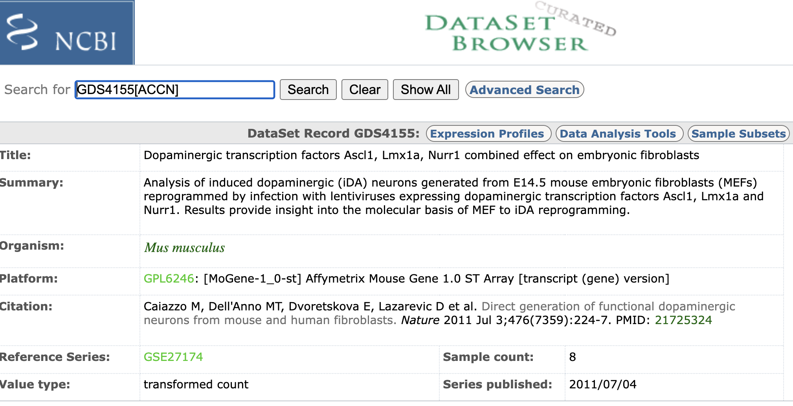
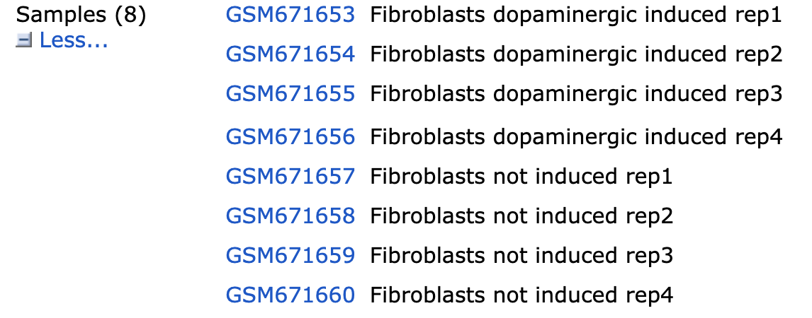

```{r class.source = 'fold-hide', setup, include=FALSE}
library(knitr)
library(rmdformats)

## Global options
options(max.print="75")
opts_chunk$set(echo=TRUE, #apareix el codi
	             cache=TRUE, #que si reexecutem el codi, allò que ja tinguem, si no ha canviat, no ho torna a fer
               prompt=FALSE,
               tidy=TRUE,
               comment=NA,
               message=FALSE,
               warning=FALSE)
opts_knit$set(width=75)
```

# CONFIGURAR L'ESPAI DE TREBALL

Al final del vídeo 1 explica com linkar el repositori de github i el projecte R. Primer hem descarregat des de la pàgina de GEO el dataset que volien i a més hem carregat les dades de github per tenir-les a l'entorn. Per descarregar el dataset ho hem fet des de: <https://www.ncbi.nlm.nih.gov/geo/query/acc.cgi?acc=GSE27174> el fitxer GSE27174_RAW.tar. Per simplement carregar les dades de github, a la terminal he escrit: git clone <https://github.com/ASPteaching/Analisis_de_datos_omicos-Ejemplo_1-Microarrays.git>



A més, hem configurat les dreceres de treball:

```{r}
setwd("/Users/annia/Desktop/UOC/DADES ÒMIQUES/ACT2.2/Series GSE27174")
WorkingDir<-getwd()
DataDir <- file.path(WorkingDir, "dades") 
ResultsDir <- file.path(WorkingDir, "resultats") 
```

Hem creat les dreceres de dades i treball.

# CARREGUEM LES DADES I LES ORGANITZEM

Creen un excel format csv on han posat els noms dels datasets descarregats, si són cas o control, un color segons si són cas o control i finalment un short name. Una vegada creat, l'importem:



```{r}
library(readr)
targets <- read_delim("dades/targets.csv", 
    delim = ";", escape_double = FALSE, trim_ws = TRUE)
View(targets)
```

Per tant ja tenim els arxius cel i targets.csv. Ara farem el codi d'ànalisi. Carreguem tots els paquets que ens ha dit:

```{r paquetes}
if (!require(BiocManager)) install.packages("BiocManager")
installifnot <- function (pkg){
  if (!require(pkg, character.only=T)){
    BiocManager::install(pkg)
  }
}
# BiocManager::install() # Actualiza paquetes instalados
BiocManager::install("arrayQualityMetrics")
library(arrayQualityMetrics)
installifnot("pd.mogene.1.0.st.v1")
installifnot("mogene10sttranscriptcluster.db")
installifnot("oligo")
installifnot("limma")
installifnot("Biobase")
installifnot("arrayQualityMetrics")
installifnot("genefilter")
installifnot("annotate")
installifnot("xtable")
installifnot("gplots")
installifnot("GOstats")
```

Ara crea l'AnnotatedDataFrame:

```{R CreemTargets}
library(Biobase)#carreguem biobase
targetsDF <- read.csv(file = file.path(DataDir, "targets.csv"), header = TRUE, sep = ";") #llegim el fitxer targets
#ara ja deixa preparats UNS ÍTEMS per després poder generar plots i etc
sampleNames <- as.character(targetsDF$ShortName)
sampleColor <- as.character(targetsDF$Colors)
#Crea un objecte AnnotatedDataFrame
targets <- AnnotatedDataFrame(targetsDF)
```

+---------------------------------------------------------------------------------------+----------------------------------------------------------------------------------------------------------------------------------------------------------------------------------------------------------------------------------------------------------+
| Annotated Data Frame                                                                  | Expression Set                                                                                                                                                                                                                                           |
+=======================================================================================+==========================================================================================================================================================================================================================================================+
| Emmagatzema metadades sobre les mostres en un experiment.                             | És una estructura més complexa que combina dades d'expressió gènica amb metadades de les mostres i dels gens.                                                                                                                                            |
|                                                                                       |                                                                                                                                                                                                                                                          |
| Conté informació com ara el grup experimental, el sexe, l'edat, etc., de cada mostra. | Conté la matriu d'expressió gènica (on les files són gens i les columnes són mostres), un `AnnotatedDataFrame` per a les metadades de les mostres i un altre `AnnotatedDataFrame` per a les metadades dels gens (com ara anotacions de funcions o vies). |
|                                                                                       |                                                                                                                                                                                                                                                          |
| S'utilitza per organitzar i descriure les mostres en un estudi.                       | És la estructura principal per emmagatzemar i analitzar dades d'expressió gènica en Bioconductor.                                                                                                                                                        |
|                                                                                       |                                                                                                                                                                                                                                                          |
| Resum: `AnnotatedDataFrame`: Metadades de les mostres o dels gens.                    | Resum: `ExpressionSet`: Combina dades d'expressió, metadades de mostres i metadades de gens.                                                                                                                                                             |
+---------------------------------------------------------------------------------------+----------------------------------------------------------------------------------------------------------------------------------------------------------------------------------------------------------------------------------------------------------+

Ara el que farem és llegir els arxius CEL i complementar la informació que tenim:

```{r arxiusCEL}
CELfiles <- targetsDF$fileName #agafem els noms dels arxius CEL
rawData <- read.celfiles(file.path(DataDir,CELfiles), phenoData=targets)
#fa servir la funció read.celfiles i els combina en un objecte.
#file.path(dataDir, CELfiles) construeix un ruta completa pels arxius CEL, que genera una ruta per a cada un.
#phenoData=targets-->es fa servir aquest objecte com la info fenotípica (metadades de les mostres) associades a les dades d'expressió
rawData
exprs(rawData) #cada fila representa un gen/sonda del microarray i cada columna és una mostra. Els valors són els nivells d'expressió de cada gen.
```

# EXPLORACIÓ I CONTROL DE QUALITAT

Anem a fer un boxplot, que en aquest cas admet un objecte tipus rawData. Aquest ens ensenyarà la distribució dels valors.

```{r graficosCalidad}
#BOXPLOT
boxplot(rawData, which="all",las=2, main="Intensity distribution of RAW data", 
        cex.axis=0.6, col=sampleColor, names=sampleNames)
```

El professor diu que s'han de normalitzar però que no es veuen masses diferències i que són resultats congruents.

Tot seguit fa un clustering jeràrquic, que ens dóna un tipus d'informació una mica diferent:

```{r graficosCalidad2}
#HIERARQUICAL CLUSTERING
clust.euclid.average <- hclust(dist(t(exprs(rawData))),method="average")
plot(clust.euclid.average, labels=sampleNames, main="Hierarchical clustering of RawData", cex=0.7,  hang=-1)
```

Ens ensenya com s'agrupen les mostres: veiem que les mostres induïdes s'assemblen més entre elles i el mateix amb les no induïdes.

Ara farem un PCA: reducció de la dimensionalitat. Ens crea unes dimensions independents entre sí i cada dimensió explica un % de variabilitat. Recordem que a columnes tenim mostres i a files cada gen. El codi que fan servir és el següent:

```{r graficosCalidad3}
#PRINCIPAL COMPONENT ANALYSIS
plotPCA <- function ( X, labels=NULL, colors=NULL, dataDesc="", scale=FALSE, formapunts=NULL, myCex=0.8,...) #ha definit una funció per fer el PCA. X serà la matriu d'expressió gènica. NO LES ESCALA.
{
  pcX<-prcomp(t(X), scale=scale) #fa la transposada; escalarà les dades si a l'anterior posa TRUE; sinó no.
  loads<- round(pcX$sdev^2/sum(pcX$sdev^2)*100,1) #calcula la variància explicada per cada component. 
  #print(loads)
  xlab<-c(paste("PC1",loads[1],"%")) #etiquetes pels eixos amb els % de cada component
  ylab<-c(paste("PC2",loads[2],"%"))
  if (is.null(colors)) colors=1 #negre si no s'especifica
  plot(pcX$x[,1:2],xlab=xlab,ylab=ylab, col=colors, pch=formapunts, 
       xlim=c(min(pcX$x[,1])-100000, max(pcX$x[,1])+100000),ylim=c(min(pcX$x[,2])-100000, max(pcX$x[,2])+100000))
  text(pcX$x[,1],pcX$x[,2], labels, pos=3, cex=myCex)
  title(paste("Plot of first 2 PCs for expressions in", dataDesc, sep=" "), cex=0.8)
}
#no podem entrar els rawdata directe i aquí sí que cal exprs(rawData)
plotPCA(exprs(rawData), labels=sampleNames, dataDesc="raw data", colors=sampleColor,
        formapunts=c(rep(16,4),rep(17,4)), myCex=0.6)
```

Veiem al gràfic que PC1 explica el 50% isegona 27%; això és \>75%. Els grups estan separats per una diagonal, pel que deduïm que necessitem aquestes dues PC.

El següent chunk passa els gràfics a PDF per tenir-los per consultar posteriorment:

```{r graficosCalidadAPDF}
#SAVE TO A FILE
pdf(file.path(ResultsDir, "QCPlots_Raw.pdf")) #inicia la creació del PDF
#ara és el codi de cada gràfic per generar en tres "pàgines" de PDF diferents.
boxplot(rawData, which="all",las=2, main="Intensity distribution of RAW data", 
        cex.axis=0.6, col=sampleColor, names=sampleNames)
plot(clust.euclid.average, labels=sampleNames, main="Hierarchical clustering of samples of RawData", 
     cex=0.7,  hang=-1)
plotPCA(exprs(rawData), labels=sampleNames, dataDesc="raw data", colors=sampleColor,
        formapunts=c(rep(16,4),rep(17,4)), myCex=0.6)
dev.off()#fi de la creació del PDF

```

# CONTROL DE QUALITAT AMB 'arrayQualityMetrics'

Això ens permet fer-ho més ràpid i no gràfic per gràfic. Li donem com a objecte el rawData i ens fa un gràfic de control de qualitat. Això sí, tarda una mica, i no sol donar més info que el que hem fet. El profe ha ficat una variable boleana per determinar si s'executa o no:

```{r arrayQM}
# Avoid re-running it each time  the script is executed.
rerun <- FALSE
if(rerun){
  arrayQualityMetrics(rawData,  reporttitle="QC_RawData", force=TRUE)
}
```

El document generat és un html que es troba dins la carpeta que li hem dit, en aquest cas, QC_RawData. Dins de l'informe que es genera veiem que hi ha una taula al principi on hi ha tres columnes que són els tres criteris que podríen indicar que hi ha un error. El tercer és el menys precís/eficient. El gràfic dos és per indicar si hi ha alguna mostra atípica, que per ser-ho ha de superar la línia negra de la dreta.

**EL CONTROL DE QUALITAT ES POT DFER ABANS I DESPRÉS DE NORMALITZAR LES DADES, PERÒ...**

**...Es recomana fer tot això abans de la normalització ja que sinó podríem veure que la variabilitat explicada en PCA és menor. Això és perquè es comprimeixen les dades i es redueix la variabilitat.**

# NORMALITZACIÓ

La farem amb el mètode rma = robust multiarray average.

```{r normalizacion}
eset<-rma(rawData) #RMA del paquet affy
write.exprs(eset, file.path(ResultsDir, "NormData.txt")) #guardar les dades en un fitxer; escriu la matriu d'expressió d'un ExpressionSet en un fitxer
eset
```

Normalització quantilica: Normalitza les dades entre els diferents arrays perquè tinguin la mateixa distribució. Les dades s'han guardat en un arxiu dins de results per tenir-los a mà. El resultat final és un expressionSet, que si ens fixem amb la sortida que ens dona, hi ha assayData: *ExpressionSet (storageMode: lockedEnvironment); assayData: 35556 features, 8 samples.* S'han agrupat les sondes, ja que si compararem amb rawdata, hi havia moltes més entrades: *GeneFeatureSet (storageMode: lockedEnvironment); assayData: 1102500 features, 8 samples.*

# FILTRAT

Ara farem un filtratge dels gens per eliminar aquells amb baixa variabilitat (si canvien poc entre els diferents grups, no ens donarà resultats; o bé els que no tenen identificador ENTREZ). El que volem és eliminar soroll innecessari i potenciar els resultats estadístics.

No és imprescindible tenir el paquet d'anotacions per filtrar (el require.entrez) però si el tenim, podrem eliminar les sondes que no estan anotades i que no solen tenir interès. Veiem al codi que fa servir el rang interquartílic, ens quedem amb el 25% més variable i que tenen ID entrez.

Amb tot això guanyem un dataset menor, que té menys gens vaja, del que hem descartat els gens que amb gran probabilitat no estaran relacionats amb el nostre problema. Ens deixarà fer el multiple testing de manera menys restrictiva. Avui en dia cada vegada es fa menys filtratge.

```{r filtrado}
annotation(rawData)
library(genefilter) #paquet necessari per fer el filtratge
annotation(eset) <- "mogene10sttranscriptcluster.db" #assigna l'anotació "mogene10sttranscriptcluster.db" al teu objecte eset. ndica que les dades d'expressió corresponen a microarrays de ratolí (mogene) i que s'utilitzarà la base de dades "mogene10sttranscriptcluster.db" per obtenir informació sobre els gens. Aquesta info no està disponible fàcilment (has de tenir experiència amb bioconductor per deduir el paquet). Adjunto explicació AI.
eset_filtered <- nsFilter(eset, var.func=IQR,
         var.cutoff=0.75, var.filter=TRUE, require.entrez = TRUE,
         filterByQuantile=TRUE)
#NUMBER OF GENES REMOVED
print(eset_filtered) #és una llista. Si l'obrim veiem que ens diu quants ha eliminat, quants tenien poca variabilitat i quants no tenien ID ENTREZ

#NUMBER OF GENES IN
print(eset_filtered$eset) #ExpressionSet amb 5041 gens
```

### **Interpretació del nom de la plataforma (`pd.mogene.1.0.st.v1`)**

-   **`mogene`** → Es refereix al *Mouse Gene* array.

-   **`1.0`** → La versió de l’array.

-   **`st`** → Significa *Sense Targeted*, que indica que l’array utilitza sondes orientades a transcripcions completes (*transcript clusters*).

-   **`v1`** → Versió de la plataforma, que no afecta l'anotació perquè fa referència al disseny físic.

Aquest nom indica que estàs treballant amb l’array "Mouse Gene 1.0 ST Array", que fa servir *transcript clusters* com a unitat d’anotació.

### **Connexió amb els paquets d’anotació**

A Bioconductor, els paquets de bases de dades per a arrays d’Affymetrix segueixen un patró consistent:

-   Els arrays que utilitzen clústers de transcripció tenen el sufix **`transcriptcluster.db`**.

-   L’arrel del nom del paquet sempre està relacionada amb el nom de la plataforma (en aquest cas, **`mogene10st`**).

Això significa que:

-   **`mogene10st`** és l’arrel perquè fa referència a "Mouse Gene 1.0 ST Array".

-   **`transcriptcluster.db`** indica que és un paquet d’anotació basat en clústers de transcripció.

### **Absència d’informació explícita en Bioconductor**

Tot i que Bioconductor no et dóna directament aquesta associació, pots deduir-ho:

-   Les plataformes `pd.*` d’Affymetrix tenen paquets associats d’anotació que segueixen el mateix prefix. Per exemple:

    -   `pd.mogene.2.0.st` → `mogene20sttranscriptcluster.db`

    -   `pd.hugene.1.0.st.v1` → `hugene10sttranscriptcluster.db`

    -   `pd.clariom.s.mouse.ht` → `clariomsmousetranscriptcluster.db`

Aquesta regularitat en els noms ajuda a deduir que:

-   `pd.mogene.1.0.st.v1` → **`mogene10sttranscriptcluster.db`**

```{r Datosfiltrados}
filteredEset <- eset_filtered$eset #extreiem l'expressionSet
filteredData <- exprs(filteredEset) #la matriu d'expressió
pData(eset_filtered$eset)$ShortName
colnames(filteredData) <- pData(eset_filtered$eset)$ShortName #canviem el nom de les columnes, així tindrem les etiquetes posteriorment.
```

# SELECCIÓ DE GENS

En aquest cas tenim únicament dos grups (inudït/no induït) i un factor a analitzar. Farem servir el programa LIMMA; aquest ens proporciona una gran quantitat d'informació com ara un estimador de la variabilitat de cada gen. Aqust càlcul el fa mirant la variabilitat de cada gen vs la variabilitat global del dataset.

Primer construïrem una matriu de disseny. Podem utilitzar *modelmatrix* indicant quin factor volem que es faci servir. La matriu de disseny és una representació matemàtica de l'estructura experimental que s'utilitza per modelar les dades i identificar els gens que canvien la seva expressió entre les condicions experimentals.

```{r linearModel}
library(limma)
pData(filteredEset)$grupos
treat <- pData(filteredEset)$grupos #extreiem la columna de gups de les metadades i ho guardem dins la varaible treat
lev <- factor(treat, levels = unique(treat))#fem que sigui factor. La part de levels assegura que els nivells del factors sigui únics i presents de la var treat.
design <-model.matrix(~0+lev) #0 indica que no es vol incloure un terme d'intercepció al model, i lev indica que es vol incloure una columna per a cada nivell del factor lev.
colnames(design) <- levels(lev)
rownames(design) <- sampleNames
#La matriu de disseny resultant tindrà una fila per a cada mostra i una columna per a cada grup experimental. Els valors de la matriu seran 1 si la mostra pertany al grup corresponent i 0 en cas contrari.
print(design)
```

Ara fem la matriu de contrast = consisteix en dir quines comparacions volem fer en forma de resta: induïts vs no afectat.

```{r linearModel2}
#COMPARISON
cont.matrix1 <- makeContrasts(  #la funció makeConstrasts és la que fa la matriu.
        Induced.vs.WT = Induced-WT,#induced vs wild type
        levels = design) #els nivells han de ser els mateixos que els de la matriu anterior
comparisonName <- "Efecto de la Inducción" #Assigna el nom "Efecto de la Inducción" a una variable anomenada comparisonName
print(cont.matrix1)
```

Ara estimarem el model. Amb el paquet limma ara ajustem un model lineal a les dades d'expressió filtrades i calculem estadísiques per a la comparació de grups. Així podrem identificar els gens que canvien significativament la seva expressió entre les condicions experimentals.

```{r estimaModelo}
#MODEL FIT
fit1 <- lmFit(filteredData, design) #ajustem el model fent servir les dades d'expressió filteredData i la matriu de disseny design.
fit.main1 <- contrasts.fit(fit1, cont.matrix1) #aplica la matriu de contrasts a fit1 per fer les estadístiques de comparació.
fit.main1 <- eBayes(fit.main1) #Calcula estadístiques moderades utilitzant un mètode empíric Bayes. eBayes=bayes empíric
```

Hi ha alternatives vàlides al mètode empíric Bayes utilitzat en el paquet `limma` per a l'anàlisi d'expressió diferencial. Algunes d'aquestes alternatives inclouen:

-   **t-test:** El t-test és una prova estadística clàssica que es pot utilitzar per comparar les mitjanes de dos grups. Es pot utilitzar per a l'anàlisi d'expressió diferencial quan es comparen dos grups experimentals.

-   **ANOVA:** L'ANOVA (anàlisi de la variància) és una prova estadística que es pot utilitzar per comparar les mitjanes de tres o més grups. Es pot utilitzar per a l'anàlisi d'expressió diferencial quan es comparen múltiples grups experimentals.

-   **SAM (Significance Analysis of Microarrays):** SAM és un mètode estadístic no paramètric que es va desenvolupar específicament per a l'anàlisi d'expressió diferencial de microarrays.

-   **Rank product:** El mètode de rank product és un altre mètode no paramètric que es pot utilitzar per a l'anàlisi d'expressió diferencial.

Per exemple, el t-test i l'ANOVA són mètodes clàssics que són fàcils d'implementar i interpretar, però poden ser menys potents que el mètode empíric Bayes quan el nombre de mostres és petit. SAM i el mètode de rank product són mètodes no paramètrics que són més robustos a la presència de valors atípics, però poden ser més difícils d'implementar.

Els resultats de l'anàlisi que hem fet estan guardats dins l'objecte `lmfit` i es poden extreure amb la instrucció `topTable`. Aquesta instrucció, `topTable`, pot aplicar un filtre automàtic basat en dos criteris diferents: "log fold change" i "p-value". En aquest cas agafarem únicament els gens amb un log-fold-change més gran de 3 i p-valor ajustat inferior a 0.05.

```{r results1}
topTab <-  topTable (fit.main1, number=nrow(fit.main1), coef="Induced.vs.WT", adjust="fdr",lfc=3, p.value=0.05) 
#de fitmain1 treiem les estadístiques. number-->indica que es volen mostrar tots els gens. coef = "Induced.vs.WT": Especifica el contrast per al qual es volen extreure els DEGs. adjust = "fdr": Indica que es vol ajustar el p-valor per controlar la taxa de falsos descobriments (FDR). lfc = 3: Especifica un log fold change (lfc) mínim de 3 per considerar un gen com a diferencialment expressat. Això significa que només es mostraran els gens que tenen un canvi d'expressió de almenys 3 vegades (en escala logarítmica) entre els grups. p.value = 0.05: Especifica un p-valor màxim de 0.05 per considerar un gen com a diferencialment expressat.
dim(topTab)
head(topTab)
```

L'estadístic B és un resultat bayesià de la probabilitat que estigui diferencialment expressat vs que no.

# ANOTACIÓ DE RESULTATS

Ara el que farem és obtenir els identificadors dels gens que ens interessen. Això ho farem obtenint els identiicadors de ENTREZ i GENE SYMBOL corresponents als probesets que hi ha a la taula de resultats (identificats amb els id de la companyia que ha produït els microarrays).

```{r}
library(mogene10sttranscriptcluster.db) #carreguem el paquet d'anotació. 
keytypes(mogene10sttranscriptcluster.db) #ens ensenya els tipus de claus disponibles. 
anotaciones<- AnnotationDbi::select (mogene10sttranscriptcluster.db,  keys=rownames(filteredData), columns=c("ENTREZID", "SYMBOL")) #obtenim les anotacions amb select; les claus són els noms de la fila de la matriu filteredDAta; li diem les columnes que volem extreure. Ho guardem tot a anotaciones. 
anotaciones
```

Habitualment es fa servir entrez, ensembl i symbol, que aquest últim no és tan estàndard però és més intuïtiu.

Ara afegirem aquesta informació a topTable. Per fer-ho, fa servir concatenació fent servir "pipes" del paquet dyplr:

```{r}
library(dplyr)
topTabAnotada <- topTab %>%  #està creant una nova taula; %>% anotador pipe que ens deixa fer múltiples operacions a la vegada
  mutate(PROBEID=rownames(topTab)) %>% #afegeix una nova columna
  left_join(anotaciones) %>% #combina les taules utiltizant unió oper l'esquerra
  arrange(P.Value) %>% #reordena el p valor en ordre descendent. 
  select(7,8,9, 1:6) #reordena les columnes:  Primer es mostren les columnes 7, 8 i 9 (que corresponen a "PROBEID", "ENTREZID" i "SYMBOL"), seguides de les columnes 1 a 6 (que contenen la resta d'informació sobre els gens diferencialment expressats).

head(topTabAnotada)
```

Amb aquests resultats, generem un nou document per tenir-lo.

```{r}
write.csv2(topTabAnotada, file= file.path(ResultsDir,"Genes seleccionados.csv"))
print(xtable(topTab,align="lllllll"),type="html",html.table.attributes="",
      file=file.path(ResultsDir,"Genes seleccionados.html"))
```

# VISUALITZACIÓ DELS RESULTATS

Podem fer un volcano plot o bé un heat map.

## VOLCANO PLOT

El volcano plot és un tipus de gràfic que mostra el log fold change (lfc) a l'eix x i el -log10 del p-valor a l'eix y. Això permet identificar fàcilment els gens que tenen un canvi d'expressió significatiu i un p-valor baix.

```{r volcanoPlot}
genenames <- AnnotationDbi::select(mogene10sttranscriptcluster.db, 
                    rownames(fit.main1), c("SYMBOL"))$SYMBOL #agafem els noms del paquet que hem fet servir fins ara. Rownames els agafem de fit.main1 que són els identificadors de les sondes. Volem extreure el símbol. Ho guardem a genenames.
volcanoplot(fit.main1, highlight=10, names=genenames, 
            main = paste("Differentially expressed genes", colnames(cont.matrix1), sep="\n"))
abline(v = c(-3, 3)) #línia per veure el logfold
#fitmain1: conté les estadístiques moderades per a la comparació entre grups; donem noms només als 10 més diferents. 

pdf(file.path(ResultsDir,"Volcanos.pdf")) #en fem un PDF.
volcanoplot(fit.main1, highlight = 10, names = genenames, 
            main = paste("Differentially expressed genes", colnames(cont.matrix1), sep = "\n"))
abline(v = c(-3, 3))
dev.off()
```

## HEATMAPS

Ara farem servir LA MATIRU D'EXPRESSIÓ.

```{r heatmap}
selectedRows <- rownames(filteredData) %in% rownames(topTab) #un vector lògic selectedRows que indica quines files de la matriu filteredData corresponen als gens presents a la taula topTab (els DEGs).
selectedData <- filteredData[selectedRows,]#una nova matriu selectedData que conté només les files de filteredData que corresponen als DEGs.

#HEATMAP PLOT
my_palette <- colorRampPalette(c("blue", "red"))(n = 299) #paleta de colors que va del blau al vermell amb 299 colors intermedis. 
library(gplots)
heatmap.2(selectedData,
          Rowv=TRUE, #agrupa gens
          Colv=TRUE, #agrupa columnes
          main="HeatMap Induced.vs.WT FC>=3",
          scale="row", #escala valors d'expressió per fila
          col=my_palette,
          sepcolor="white",
          sepwidth=c(0.05,0.05),
          cexRow=0.5,
          cexCol=0.9,
          key=TRUE, #mostra llegenda
          keysize=1.5,
          density.info="histogram",
          ColSideColors=c(rep("red",4),rep("blue",4)), #colors per marcar els grups experimentals
          tracecol=NULL,
          srtCol=30) #rota etiquetes

#creem el PDF
pdf(file.path(ResultsDir,"Heatmap.pdf"))
heatmap.2(selectedData,
          Rowv=TRUE,
          Colv=TRUE,
          main="HeatMap Induced.vs.WT FC>=3",
          scale="row",
          col=my_palette,
          sepcolor="white",
          sepwidth=c(0.05,0.05),
          cexRow=0.5,
          cexCol=0.9,
          key=TRUE,
          keysize=1.5,
          density.info="histogram",
          ColSideColors=c(rep("red",4),rep("blue",4)),
          tracecol=NULL,
          srtCol=30)
dev.off()
```

Hi ha dos grups de gens: uns, els vermells, que estan menys expressats en el wild type i més a l'induït; i uns al revés. Hem seleccionat expressament els més expressats, per tant, el gràfic és purament confirmatiu.

# ANÀLISI DE SIGNIFICACIÓ BIOLÒGICA

Fan un anàlisi de sobre-representació, que busca si entre les anotacions hi ha alguna categoria (amb gene onthology o així) que apareixi amb més freqüència que la real esperada.

Per fer això necessitem:

-   Una llista seleccionada.

-   L'univers de gens, és a dir, tots els gens que s'han inclós a l'anàlisi (depenent de l'usuari es posen tots els del xip o tots els del genoma).

La majoria de programes necessites que els identificadors dels gens siguin format `ENTREZ`, pel que prepararem ambdues llistes a la vegada (tot i que ja teníem la dels gens seleccionats).

```{r creaciopoolgens}
library(mogene10sttranscriptcluster.db)#carreguem el paquet d'anotació 
probesUniverse <- rownames(filteredData) #vector que conté els noms de la fila de la matriu fileData. Són els noms dels identificadors de les sondes de microarray i són l'univers de gens.
entrezUniverse<- AnnotationDbi::select(mogene10sttranscriptcluster.db, probesUniverse, "ENTREZID")$ENTREZID
#agafem els ID d'entrez.
topProbes <-   rownames(selectedData) #les claus que s'utilitzaran per identificar els gens.
entrezTop<- AnnotationDbi::select(mogene10sttranscriptcluster.db, topProbes, "ENTREZID")$ENTREZID

topGenes <- entrezTop[!duplicated(entrezTop)] #Elimina els IDs d'Entrez duplicats del vector entrezTop i emmagatzema el resultat en un vector anomenat topGenes
entrezUniverse <- entrezUniverse[!duplicated(entrezUniverse)] #Elimina els IDs d'Entrez duplicats del vector entrezUniverse
```

Hi ha múltiples paquets per fer l'anàlisi d'enriquiment genètic. Cada paquet fa coses diferents però les idees subjacents són les mateixes.

En aquest cas veurem `GEOstats`; és un dels primers paquets disponibles de Bioconductor per fer l'anàlisi d'enriquiment. Per fer-lo servir s'ha de crear un objecte anomenat "hiperparàmentre" que pot ser de classe tipus:

-   `GOHyperGParams` farà l'anàlisi basat en Gene Ontology.
-   `KEGGHyperGParams` anàlisi basat en la base de dades REACTOMA
-   `PFAMHyperGParams` basat en la base de dades de PFAM.

```{r createHyperparameter}
library(GOstats) #carreguem el paquet
#L'objecte GOHyperGParams té un argument ontology que pot ser "BP" - biological process, "MF"-molecular function o "CC"-cellular component. 
GOparams = new("GOHyperGParams",
    geneIds=topGenes, universeGeneIds=entrezUniverse,
    annotation="mogene10sttranscriptcluster.db", ontology="BP",
    pvalueCutoff=0.01)
#creem un objecte amb els IDs de topGenes, els de l'univers, fem l'anàlisi amb biological process i el llindar estadístic el posem a 0.01. 
#S'hauria de fer per a cada ontologia. 
```

```{r runORAnalysis}
GOhyper = hyperGTest(GOparams)
```
Executem el test i guardem el resultat a GOhyper. Aquest objecte conté ID del terme GO, Nom del terme GO, p-valor (de la prova hipergeomètrica; indica significació de l'enriquiment), nombre de gens, nombre esperat de gens (nombre de gens que s'esperaria que estiguessin associats al terme GO per atzar) i odds ratio (indica la magnitud de l'enriquiment). El test hipergeomètric és un test de fisher. 

```{r summarizeORAesults}
head(summary(GOhyper))
dim(summary(GOhyper))
```
La primera columna ens ensenya quina categoria de la GO està més enriquida, quantes vegades més abundant és respecte el que esperaríem (OR=1, igual d'abundant). 

Gravem els resultats. 


```{r ORAreport}
# Creamos un informe html con los resultados
GOfilename =file.path(ResultsDir, "GOResults.html")
htmlReport(GOhyper, file = GOfilename, summary.args=list("htmlLinks"=TRUE))
```

Una vegada finalitzat l'anàlisi recomana el profe recòrrer tot el document des de zero per a assegurar-nos que el codi és reproduïble. 

Per tant, al final què tenim? 
A dins de la carpeta de resultats tenim: 

- Els gens que estan diferencialment expressats (topTable)

- Resultats de significació biològica

- Gràfics de control de qualitat

- Gràfic Vulcano

